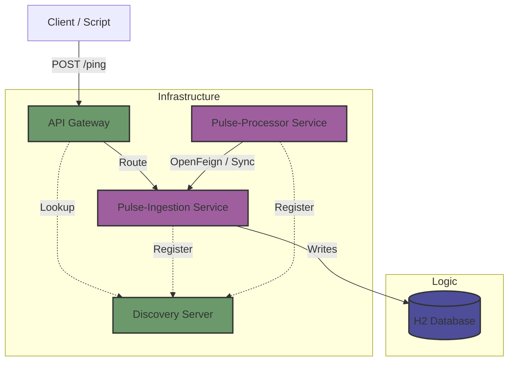

# PulseGuard

---


### Distributed "Dead Man's Switch" Monitoring System
**PulseGuard** is a cloud-native microservices platform designed to monitor the liveness of background jobs, cron tasks, and backup scripts. Unlike traditional uptime monitors that ping a URL, PulseGuard waits for the monitored service to "check-in." If a signal is missed, an alert is triggered.


## Architecture

---

PulseGuard is built on a strict **Microservices Architecture** using **Java 21** and the **Spring Boot 3.5 / Spring Cloud 2025** ecosystem.




## Tech Stack

---
- **Core:** Java 21, Spring Boot 3.5.x
- **Cloud Native:** Spring Cloud Gateway, Netflix Eureka (Discovery)
- **Communication:** OpenFeign (Synchronous REST), RESTful APIs
- **Data:** Spring Data JPA, H2 (In-Memory / Pluggable)
- **Tooling:** Maven (Multi-Module), Docker, Docker Compose, Lombok


## Getting Started

---
### Prerequisites
- Java 21 SDK
- Maven 3.8+
- Docker (Optional, for containerized deployment)

### Intallation
1) Clone the repository
```bash
  git clone https://github.com/stefanobini99/pulseguard.git
  cd pulseguard 
```
2) Build the project This project is a Maven Multi-Module build. Run the build from the root directory:
```bash
  mvn clean install
```

## How to run

---
### Option A: Cloud-Native (Docker Compose) - Recommended
This spins up the entire infrastructure (Discovery, Gateway, Databases, Services) in an isolated network.
```bash
  docker-compose up --build -d
```
- Eureka Dashboard: http://localhost:8761
- API Gateway: http://localhost:8080

### Option B: Local Development (Manual)
If you do not have Docker running locally, you can start the services individually in this specific order:

- Discovery Server: Run ```DiscoveryServerApplication```
- API Gateway: Run ```ApiGatewayApplication```
- Ingestion Service: Run ```PulseIngestionApplication```
- Processor Service: Run ```PulseProcessorApplication```

## Module Overview

---
| Module                 | Port       | Description                                                                         |
|:-----------------------|:-----------|:------------------------------------------------------------------------------------|
| ```discovery-server``` | ```8761``` | Eureka Server. Acts as the service registry.                                        |
| ```api-gateway```      | ```8080``` | Spring Cloud Gateway. Single entry point. Handles routing & load balancing.         |
| ```pulse-ingestion```  | ```8081``` | Write-Heavy Service. High-throughput ingestion of heartbeats. Owns the H2 Database. |
| ```pulse-processor```  | ```8082``` | Logic Service. Runs scheduled tasks (```@Scheduled```) to detect stale monitors.    |

## API Reference

---
1. **Send a Heartbeat (Ping)**

    Scripts call this endpoint to confirm they are alive.
```bash
  curl -X POST http://localhost:8080/api/v1/ingestion \
     -H "Content-Type: application/json" \
     -d '{"monitorId": "backup-script-01", "status": "OK"}' 
```

2. **View Dead Monitors (Internal/Debug)**
   
    The Processor service calls this endpoint via OpenFeign to verify status.

```bash
    curl http://localhost:8080/api/v1/ingestion/dead-monitors
```

## Future Roadmap & Optimizations

---
### Phase 2: Performance (Database Optimization)
Currently, the ```getDeadMonitors()``` logic uses a Java Stream implementation for the MVP.
- Current State: Fetches dataset and filters in-memory (```O(N)```).
- Planned Upgrade: Migration to a custom **JPQL/Native Query** to handle the "Greatest-N-Per-Group" problem directly in the database engine for ```O(1)``` performance at scale.

### Phase 3: Resilience
- Implement **Resilience4j** Circuit Breakers on the Gateway.
- Migrate from H2 (In-Memory) to **PostgreSQL** for persistence.

## Author

---
**Stefano Bini** *Java Software Developer | Spring Ecosystem Specialist*

---
### Check out my [portfolio](https://stefanobini99.github.io/)